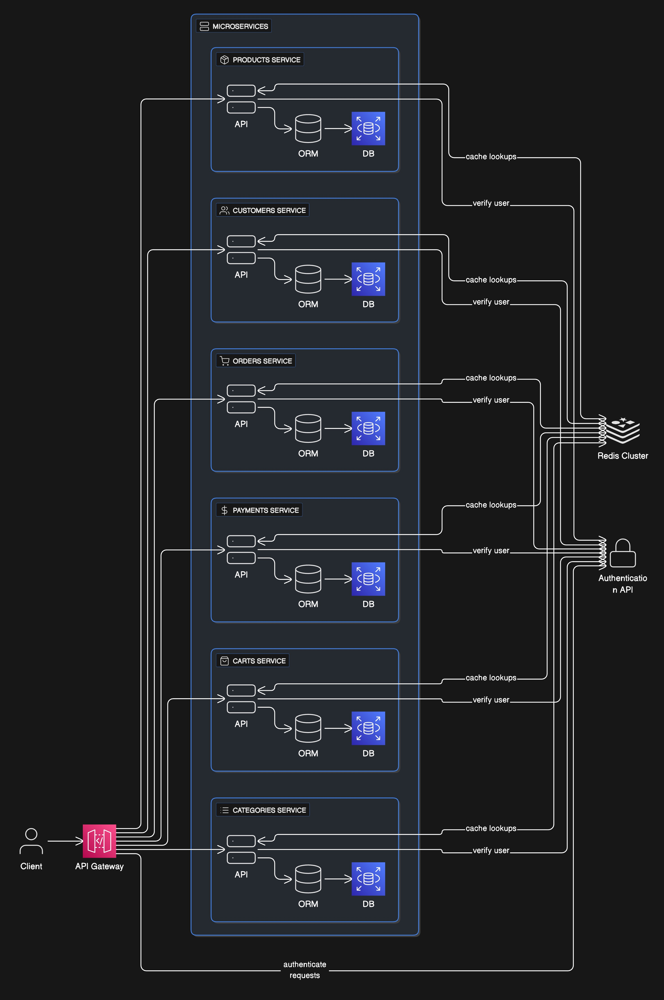

# Action-Commerce

A headless e-commerce platform built with microservices architecture featuring role-based authentication, product management, and shopping cart functionality.



## Architecture Overview

This project consists of 5 microservices:

1. **API Gateway** (Port 3000) - Routes requests to appropriate microservices
2. **User Management** (Port 6001) - Authentication, authorization, and user management using PostgreSQL
3. **Products** (Port 6002) - Product catalog management using MongoDB
4. **Categories** (Port 6003) - Product categories management using MongoDB
5. **Cart** (Port 6004) - Shopping cart functionality using MongoDB

## Features

- **Role-based Authentication**: Admin, Manager, and Customer roles
- **JWT Token Authentication**: Secure API access
- **Database Optimization**: PostgreSQL for user data, MongoDB for product/cart data
- **Microservices Architecture**: Independent, scalable services
- **API Gateway**: Centralized routing and service discovery

## Prerequisites

- Node.js (v18 or higher)
- PostgreSQL (for user management)
- MongoDB (for products, categories, and cart)
- npm or yarn

## Quick Start

### 1. Install Dependencies

```bash
# Install dependencies for all services
cd user-management && npm install && cd ..
cd products && npm install && cd ..
cd categories && npm install && cd ..
cd cart && npm install && cd ..
cd api-gateway && npm install && cd ..
```

### 2. Database Setup

**PostgreSQL Setup:**
```bash
# Create database for user management
createdb ms_action_users_db
```

**MongoDB Setup:**
```bash
# Start MongoDB service
mongod

# Create databases (they will be created automatically on first connection)
# - ms_action_products_db
# - ms_action_categories_db  
# - ms_action_cart_db
```

### 3. Environment Configuration

Each service has its own `.env.local` file with default configurations. Update them as needed:

- `user-management/.env.local` - PostgreSQL connection and JWT settings
- `products/.env.local` - MongoDB connection and service URLs
- `categories/.env.local` - MongoDB connection (already configured)
- `cart/.env.local` - MongoDB connection and service URLs
- `api-gateway/.env` - Service URLs and gateway port

### 4. Start Services

Start each service in separate terminals:

```bash
# Terminal 1: User Management Service
cd user-management && npm run dev

# Terminal 2: Products Service  
cd products && npm run dev

# Terminal 3: Categories Service
cd categories && npm run dev

# Terminal 4: Cart Service
cd cart && npm run dev

# Terminal 5: API Gateway
cd api-gateway && npm run dev
```

## API Endpoints

### Authentication (via API Gateway)

```bash
# Register a new user
POST http://localhost:3000/auth/register
{
  "email": "user@example.com",
  "password": "password123",
  "firstName": "John",
  "lastName": "Doe",
  "role": "customer"  // optional: "admin", "manager", "customer"
}

# Login
POST http://localhost:3000/auth/login
{
  "email": "user@example.com",
  "password": "password123"
}

# Verify token
POST http://localhost:3000/auth/verify
Headers: Authorization: Bearer <token>
```

### Products (via API Gateway)

```bash
# Get all products (public)
GET http://localhost:3000/products

# Get product by ID (public)
GET http://localhost:3000/products/:productId

# Create product (admin/manager only)
POST http://localhost:3000/products
Headers: Authorization: Bearer <token>

# Update product (admin/manager only)
PATCH http://localhost:3000/products/:productId
Headers: Authorization: Bearer <token>

# Delete product (admin only)
DELETE http://localhost:3000/products/:productId
Headers: Authorization: Bearer <token>
```

### Categories (via API Gateway)

```bash
# Get all categories
GET http://localhost:3000/categories

# Get category by ID
GET http://localhost:3000/categories/:categoryId

# Create category (admin/manager only)
POST http://localhost:3000/categories
Headers: Authorization: Bearer <token>
```

### Cart (via API Gateway)

```bash
# Get user's cart (authenticated)
GET http://localhost:3000/carts
Headers: Authorization: Bearer <token>

# Create cart (authenticated)
POST http://localhost:3000/carts
Headers: Authorization: Bearer <token>

# Add item to cart (authenticated)
POST http://localhost:3000/carts/:cartId/line-items
Headers: Authorization: Bearer <token>

# Remove item from cart (authenticated)
DELETE http://localhost:3000/carts/:cartId/line-items/:lineItemId
Headers: Authorization: Bearer <token>

# Get all carts (admin only)
GET http://localhost:3000/carts/admin/all
Headers: Authorization: Bearer <token>
```

## User Roles

- **Admin**: Full access to all resources, can manage users, products, categories, and view all carts
- **Manager**: Can manage products and categories, limited user management
- **Customer**: Can view products, manage their own cart, basic profile access

## Data Models

### Cart Object Structure
```json
{
  "type": "Cart",
  "id": "27b39077-aa57-48a5-b504-914f68fa44dc",
  "version": 1,
  "createdAt": "2023-01-23T13:06:28.569Z",
  "lastModifiedAt": "2023-01-23T13:06:28.569Z",
  "lastModifiedBy": {"isPlatformClient": false},
  "createdBy": {"isPlatformClient": false},
  "lineItems": [],
  "cartState": "Active",
  "totalPrice": {
    "type": "centPrecision",
    "currencyCode": "EUR",
    "centAmount": 0,
    "fractionDigits": 2
  },
  "customerId": "user-id"
}
```

### Product Object Structure
```json
{
  "id": "e7ba4c75-b1bb-483d-94d8-2c4a10f78472",
  "version": 2,
  "masterData": {
    "current": {
      "categories": [{"id": "category-id", "typeId": "category"}],
      "description": {"en": "Sample description"},
      "masterVariant": {
        "id": 1,
        "sku": "sku_MB_PREMIUM_TECH_T_variant1",
        "prices": [{
          "value": {
            "type": "centPrecision",
            "fractionDigits": 2,
            "centAmount": 10000,
            "currencyCode": "EUR"
          }
        }]
      },
      "name": {"en": "MB PREMIUM TECH T"},
      "slug": {"en": "mb-premium-tech-t"}
    }
  }
}
```

## Development

### Building Services

```bash
# Build individual services
cd user-management && npm run build
cd products && npm run build  
cd categories && npm run build
cd cart && npm run build
```

### Testing

```bash
# Run tests (when implemented)
npm test
```

## Deployment

Each service can be deployed independently using the included `serverless.yml` configurations or containerized with Docker.

## Contributing

1. Fork the repository
2. Create a feature branch
3. Make your changes
4. Add tests if applicable
5. Submit a pull request

## License

ISC License
